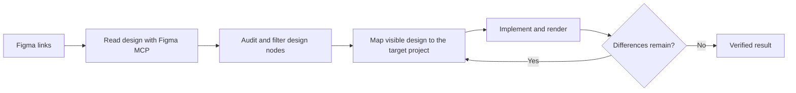
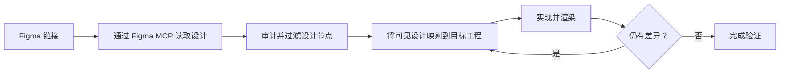
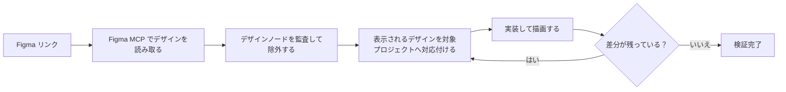

# Visual Restoration

<p align="center">
  <a href="#english">English</a> ·
  <a href="#中文">简体中文</a> ·
  <a href="#日本語">日本語</a>
</p>

> A general-purpose skill that helps coding agents turn Figma designs into high-fidelity product UI.


### Why this skill exists

Figma MCP is excellent at exposing a design file to a coding agent. But access to design data is not the same as understanding how to build the design in a real product.

A Figma file may contain covered layers, old versions, duplicate elements or layout scaffolding that is invisible to people but still returned by MCP. Figma MCP also does not know which components, styles and platform conventions the target project should use, nor can it prove that the final rendered UI actually matches the design. As a result, an agent may implement the wrong nodes, choose unsuitable components or stop when the code looks plausible rather than when the UI is faithful.

Visual Restoration closes that gap. It gives coding agents an independent, reusable workflow for reading a Figma design, filtering misleading design data, mapping the visible design to the target project, implementing it and checking the rendered result. The workflow is designed to work across projects, design languages, platforms and development processes.

### How it works



The skill follows five simple steps:

1. **Read the design** — use Figma MCP to retrieve the relevant frames, visible appearance, properties and assets.
2. **Audit the design** — remove covered, stale, duplicated, structural or system-owned nodes that should not become product UI.
3. **Map the design** — match the visible design to the components, styles, resources and platform behavior available in the target project.
4. **Implement the UI** — make the scoped changes while preserving existing product behavior and dynamic content.
5. **Verify and correct** — compare the rendered result with the design, find what is still different and repeat until the result is verified or a clear limitation remains.

The audit matters because a node returned by Figma MCP is not automatically a node that should be implemented. When the skill cannot determine whether something belongs in the product, it keeps the uncertainty visible instead of guessing.

### How to use

Invoke `visual-restoration` in your coding agent and provide one or more Figma page or frame links:

```text
Use $visual-restoration with these Figma links:

https://www.figma.com/design/AbCdEfGhIjKlMnOpQrStUv/Example-Account?node-id=100-200
https://www.figma.com/design/AbCdEfGhIjKlMnOpQrStUv/Example-Account?node-id=300-400
https://www.figma.com/design/ZyXwVuTsRqPoNmLkJiHgFe/Example-Settings?node-id=500-600
```

These are synthetic links that follow the common Figma design-link format; they do not point to real files. Replace them with the links to the screens or states you want to implement. The coding agent will use the available Figma, source, build and capture capabilities in the target environment to complete the workflow.

### Platforms

Visual Restoration has been validated on Web, iOS and Android projects, with strong results on all three platforms. It is not tied to a particular UI framework or design system. Final fidelity still depends on the quality of the design and on the capabilities available in the target environment.

### Privacy

Do not include private Figma links, screenshots, source paths, runtime data, personal information, credentials or build metadata in a public release. Use synthetic examples in public documentation and review project-specific evidence before sharing it.

### License

MIT License. See [`LICENSE`](LICENSE).

---

## 中文

### 为什么需要这个 skill

Figma MCP 很擅长把设计文件中的信息提供给 coding agent，但能够读取设计数据，并不等于能够理解如何在真实产品中正确实现这份设计。

Figma 文件中可能存在被覆盖的图层、旧版本、重复元素或布局脚手架。它们在人眼看到的设计中不可见，却仍然可能被 MCP 返回。Figma MCP 也不知道目标工程应该使用哪些组件、样式和平台规范，更无法证明最终渲染出的 UI 是否真的符合设计。因此，agent 可能实现了错误的节点、选择了不合适的组件，或者在代码看起来合理时就停止，而不是在 UI 真正还原后停止。

Visual Restoration 用来弥补这个缺口。它为 coding agent 提供一套独立、可复用的工作流程：读取 Figma 设计、过滤会误导实现的设计数据、将可见设计映射到目标工程、完成实现，并检查实际渲染结果。这个流程适用于不同工程、设计语言、平台和开发流程。

### 工作流程



skill 只做五件核心事情：

1. **读取设计**——通过 Figma MCP 获取相关 Frame、可见外观、属性和资源。
2. **审计设计**——排除被覆盖、过期、重复、结构性或系统负责的节点，避免把它们实现成产品 UI。
3. **映射设计**——将可见设计与目标工程已有的组件、样式、资源和平台行为进行匹配。
4. **实现 UI**——在保留现有产品行为和动态内容的前提下，完成限定范围内的修改。
5. **验证并修正**——将实际渲染结果与设计稿对比，找出仍有差异的部分并继续修正，直到完成验证或只剩明确的限制。

设计审计很重要，因为 Figma MCP 返回的节点并不一定都应该被实现。当 skill 无法判断某个内容是否属于产品时，它会明确保留这个不确定性，而不是直接猜测。

### 如何使用

在 coding agent 中调用 `visual-restoration`，并提供一个或多个 Figma 页面或 Frame 链接：

```text
Use $visual-restoration with these Figma links:

https://www.figma.com/design/AbCdEfGhIjKlMnOpQrStUv/Example-Account?node-id=100-200
https://www.figma.com/design/AbCdEfGhIjKlMnOpQrStUv/Example-Account?node-id=300-400
https://www.figma.com/design/ZyXwVuTsRqPoNmLkJiHgFe/Example-Settings?node-id=500-600
```

这些链接是符合常见 Figma design 链接格式的虚构示例，并不指向真实文件。实际使用时，将它们替换为需要实现的页面或状态链接即可。coding agent 会结合目标环境中可用的 Figma、源码、构建和截图能力完成整个流程。

### 已验证平台

Visual Restoration 已经在 Web、iOS 和 Android 工程中进行过验证，并在三个平台上都取得了很好的表现。它不绑定特定 UI 框架或设计系统。最终保真度仍然取决于设计稿质量，以及目标环境能够提供的能力。

### License

采用 MIT License（MIT 许可证），详见 [`LICENSE`](LICENSE)。

---
### この skill が必要な理由

Figma MCP は、デザインファイルの情報を coding agent に提供することには優れています。しかし、デザインデータを読み取れることと、実際の製品でそのデザインを正しく実装できることは同じではありません。

Figma ファイルには、覆われたレイヤー、古いバージョン、重複要素、レイアウト用の足場が含まれることがあります。これらは人が見るデザインでは見えなくても、MCP から返される場合があります。また、Figma MCP は対象プロジェクトで使うべきコンポーネント、スタイル、プラットフォーム規約を知りません。最終的に描画された UI がデザインと本当に一致するかを証明することもできません。そのため、agent が誤ったノードを実装したり、不適切なコンポーネントを選んだり、UI が忠実に再現される前に「コードは妥当に見える」と判断して止まることがあります。

Visual Restoration は、この不足を埋めます。Figma デザインを読み取り、実装を誤らせるデザインデータを除外し、表示されるデザインを対象プロジェクトへ対応付け、実装し、実際の描画結果を確認するための、独立した再利用可能なワークフローを coding agent に提供します。このワークフローは、さまざまなプロジェクト、デザイン言語、プラットフォーム、開発プロセスで利用できます。

### ワークフロー



skill が行う中核処理は 5 つだけです。

1. **デザインを読み取る** — Figma MCP を使い、対象の Frame、表示上の見た目、プロパティ、アセットを取得します。
2. **デザインを監査する** — 覆われた、古い、重複した、構造上だけの、またはシステムが所有するノードを除外し、製品 UI として実装されないようにします。
3. **デザインを対応付ける** — 表示されるデザインを、対象プロジェクトで利用できるコンポーネント、スタイル、リソース、プラットフォーム動作へ対応付けます。
4. **UI を実装する** — 既存の製品動作と動的コンテンツを維持しながら、対象範囲の変更を行います。
5. **検証して修正する** — 実際の描画結果をデザインと比較し、残る差分を修正して、検証が完了するか明確な制限だけが残るまで繰り返します。

デザイン監査が重要なのは、Figma MCP が返したノードが必ずしも実装すべきノードとは限らないためです。skill が製品に含めるべきか判断できない場合は、推測せず、不確実性を明示したままにします。

### 使用方法

coding agent で `visual-restoration` を呼び出し、1 つ以上の Figma ページまたは Frame のリンクを渡します。

```text
Use $visual-restoration with these Figma links:

https://www.figma.com/design/AbCdEfGhIjKlMnOpQrStUv/Example-Account?node-id=100-200
https://www.figma.com/design/AbCdEfGhIjKlMnOpQrStUv/Example-Account?node-id=300-400
https://www.figma.com/design/ZyXwVuTsRqPoNmLkJiHgFe/Example-Settings?node-id=500-600
```

これらは一般的な Figma design リンク形式に従った架空の例であり、実在するファイルを指していません。実際には、実装したい画面または状態のリンクへ置き換えてください。coding agent は対象環境で利用できる Figma、ソース、ビルド、スクリーンショット取得機能を使ってワークフローを完了します。

### 検証済みプラットフォーム

Visual Restoration は Web、iOS、Android のプロジェクトで検証されており、3 つすべてのプラットフォームで良好な結果を示しています。特定の UI フレームワークやデザインシステムには依存しません。最終的な忠実度は、デザインの品質と対象環境で利用できる機能に依存します。

### プライバシー

公開リリースには、非公開の Figma リンク、スクリーンショット、ソースパス、実行時データ、個人情報、認証情報、ビルドメタデータを含めないでください。公開ドキュメントには架空の例を使用し、プロジェクト固有の証拠は共有前に別途確認してください。

### License

MIT License（MITライセンス）です。詳細は [`LICENSE`](LICENSE) を参照してください。
